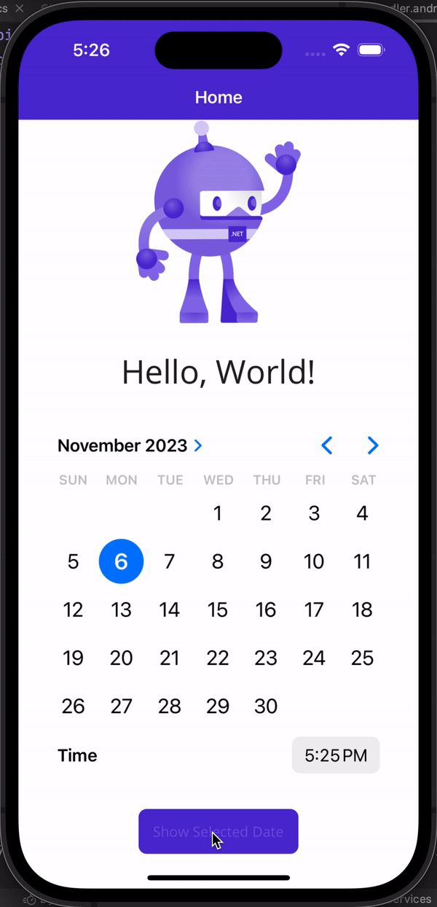
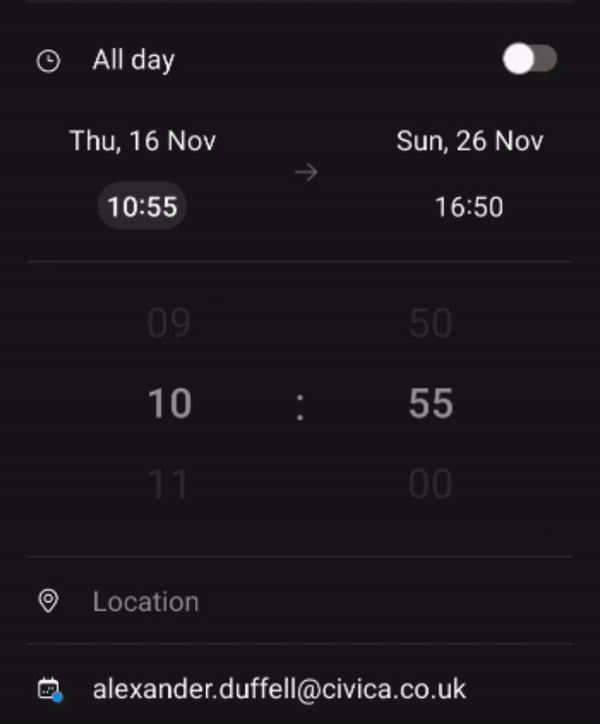

# Maui.DateTimePicker
DateTimePicker in Maui using platform native controls.

> This library is a work in progress, iOS is complete & Android might take some trial and error. Any help / suggestions would be more than welcome!

## iOS

Here is the sample app running on iOS:

## Android

Android lacks a fully native control to select date & time together, but the `CalendarView` and `TimePicker` widgets combined can fulfil this requirement. The idea for this control is to create a control similar to the samsung calendar app (seen below) where both date and time values can be selected from the same view.

